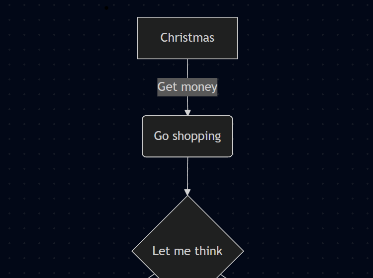

# Module 02 - Live Session

- [x] Why is % used to identify even or odd and how is it related to Boolean, true or false?
- [x] Can you go over edge cases? Some unusual inputs are still accounted for without having to write extra code, so by definition would that be an edge case?
- [x]  In homework, are we storing the information about the cities and their high and low temperatures in a particular format (table, list, etc.)? (short answer: no, should just be using if/else statements)
  - [x] Addition: common questions on the homework 
  - [x] Why do i encourage not using additional python features (even if you know them)

## Observations
The following are observations from team chats and coding practice
- [x] Can you explain why `print("A" and "B")` prints `B`, but `print("A" or "B")` prints `A`
- [x] Can you better explain the `if __name__ == "__main__:"`

Most notes in [LiveSession02.ipynb](./LiveSession02.ipynb)

