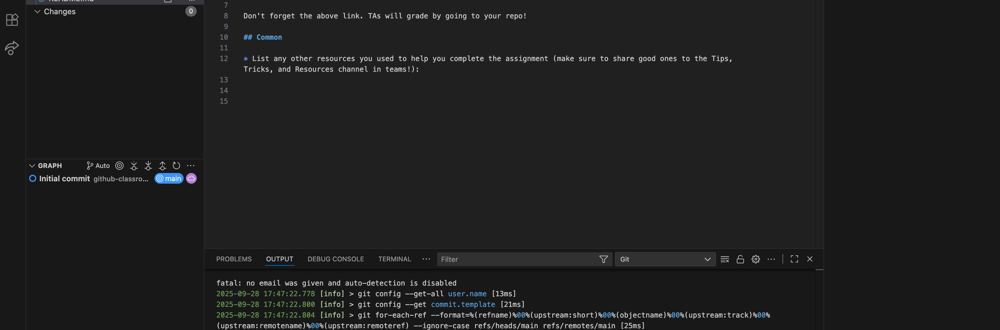

# ReadMe, Module 04 Live Session


- [ ] How can we write our code so that it runs examples as tests the way the homework does (like when we're doing practice problems)? Or is that a whole later area -- (more advanced topic but will be happy to cover it)
- [ ] "The most common mistake is not setting your user.name and user. email." from the Homework 4 Assignment details. Would you delve into this a little more?

## My additions

- [ ] Can you demonstrate git/github again (matches video)
- [ ] Explain the function mantra - and how that helps  
  (often people do it in the wrong order!)
- [ ] Loop examples, debugging loops? any needed?

## doctest

Doctest is actually a command line tool (like pycodestyle). So you can take any python file, but running it is slightly different due to how it is setup. Instead you need to do the following

```bash
> python -m doctest filename.py
```

You may also want to add the verbose argument 

```bash
> python -m doctest -v filename.py
```

> [!CAUTION]
> Remember, Macos and linux use `python3`, not python

## Common Mistake



If you get this error generated, you want to run from the command line

```bash
> git config --global user.name "Your Name"
> git config --global user.email "Your Email"
```

Git requires changes (commits) to be "signed" by the person doing it. These are used for that signing. After you set them once, you don't have to set them again. So if you get the above error, run those commands in your terminal, then try committing and pushing to github again. 